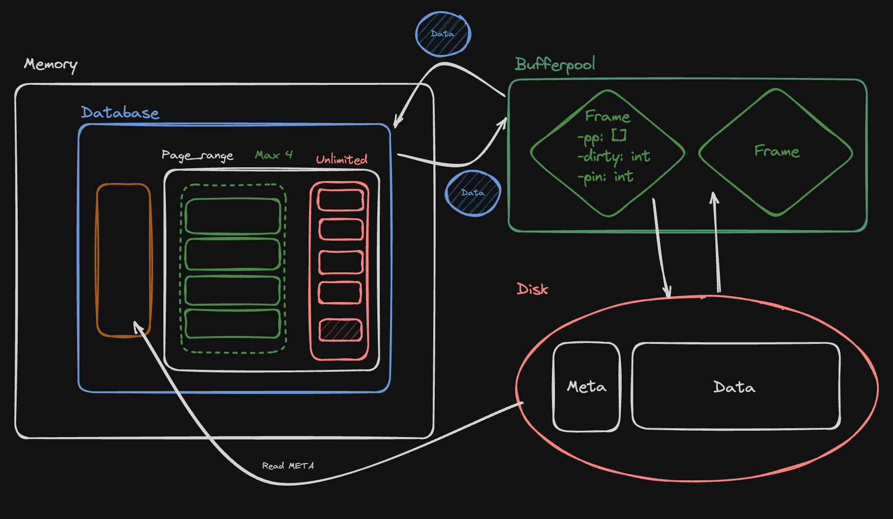
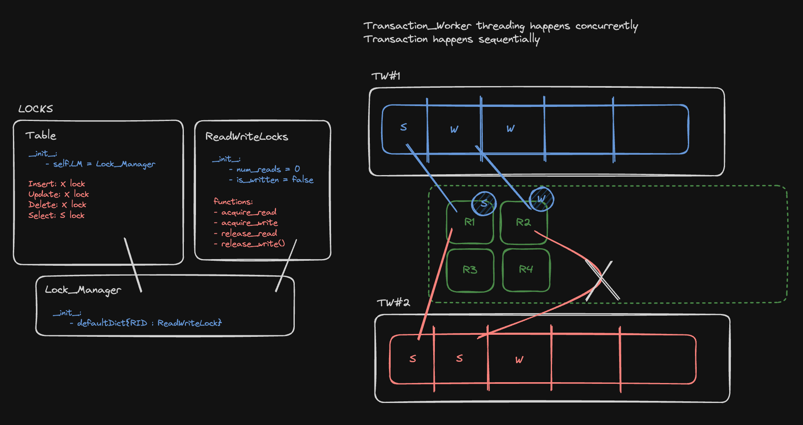

# LStore-Database

### Team: Kiwi ~~Calvin~~ Bear~~s~~ Squid

#### Members: Teeranade Cheng (Win), Nikko Sanchez, Diego Rafael

## Table of Contents

- [Introduction](#introduction)
- [Implementation](#implementation)

## Introduction

The Lineage-based Data Store (L-Store) merges transactional and analytical processing in one engine with a new lineage-based storage, enabling seamless and contention-free updates from write-optimized to read-optimized formats while ensuring transactional integrity and historical data access.

### Data Models

LStore is a columnar database. Physical Pages make up the unit of data, containing only 8 bytes. Base Pages are used for the initial insert of records while Tail Pages handle updating of the records within Base Pages. Each record is tracked by the indirection which can then be used for traceback, getting the records historical data.

```bash
|-- Database
    |-- Table
        |-- Page Range
            |-- Base Page
                |-- Physical Pages
            |-- Tail Page
                |-- Physical Pages

#Example Case
|-- ECS165
    |--Grades
        |--PR0
            |--BP0
                |--PP0
                |--PP1
            |--BP1
            |--TP0
            |--TP1
    |--Students
        |--PR0
            |--BP0
            |--TP0
```

## Implementation

### Durability

<!-- Put MemoryDiskBuffer Image down -->


- Memory
- Bufferpool
- Disk

Every operation is handled by the table which exists in memory. The Bufferpool is an small allocation of space which acts as a cache for handling data since operations done directly to a frame are costly. The disk handles durable data which is only accessible by the bufferpool when we **evict** or **import** a frame.

### Concurrency



- Locking
    - Lock Manager 
    - ReadWriteLocks 
- Latches
- Transactional Worker

We implemented our database using Python with **Transactional Workers** running concurrently, While transactions run sequentially since transactional workers run concurrently, the operations are considered to be concurrent. However, there are multiple issues that arises with different things accessing the same data at the same time. One such issue is called <a href="#">Race Condition</a>. To prevent this we implement **locks** (for data) and **latches** (for data structure i.e. table, page_range, lock_manager, etc) 

By using this layered approach, the L-Store database efficiently handles concurrency, enabling high throughput for read operations and consistency for writes. Race conditions are averted by the strict protocol of acquiring and releasing locks through the Lock Manager, coupled with the concurrent, yet isolated, processing of transactions by individual transactional workers.

**Lock Manager**: Central to the mechanism, the Lock Manager coordinates access to database resources. It utilizes a default dictionary to associate each record ID (RID) with a corresponding ReadWriteLock.

**ReadWriteLocks**: These are objects that manage the state of each lock, including the count of read operations (num_reads) and whether a write has occurred (is_written). They offer functions to acquire and release read and write locks, ensuring that multiple reads can occur simultaneously, but write operations are exclusive.

